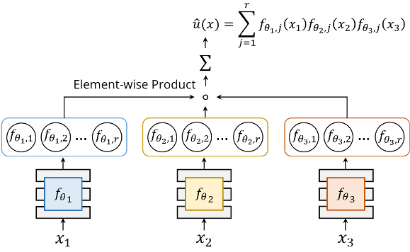

# Jax implementation of Separable PINN
### [Project Page](https://jwcho5576.github.io/spinn/) | [Paper](https://arxiv.org/abs/2211.08761)

[Junwoo Cho](https://github.com/jwcho5576)\*, 
[Seungtae Nam](https://github.com/stnamjef)\*, 
[Hyunmo Yang](https://github.com/extremebird),
[Youngjoon Hong](https://www.youngjoonhong.com/), 
[Seok-Bae Yun](https://seokbaeyun.wordpress.com/), 
[Eunbyun Park](https://silverbottlep.github.io/)&dagger;\
*Equal contribution, &dagger;Corresponding author.\
The Symbiosis of Deep Learning and Differential Equations (DLDE), NeurIPS 2022 Workshop.

# Architecture overview


* SPINN consists of multiple MLPs, each of which takes an individual 1-dimensional coordinate as an input.
* The output is constructed by a simple product and summation.


# Environment Setup
#### 0. If you're using Google Colab, just run the code

#### 1. Install Docker and NVIDIA Container Toolkit
* please follow the official [document](https://docs.nvidia.com/datacenter/cloud-native/container-toolkit/install-guide.html#docker) for installation.
* if you already installed both of them, please skip this part.

#### 2. Build the docker image
* run the command below at "/your/path/to/SPINN".
* don't forget to include the dot at the end.
```
docker build -t spinn_environment .
```

#### 3. Run the docker image
* run the command below at "/your/path/to/SPINN".
```
docker run -it -v $(pwd):/workspace -p 8888:8888 --gpus all --ipc host --name spinn spinn_environment:latest
```

#### 4. Launch Jupyter and run the code
* run the command below inside the container.
```
jupyter notebook --allow-root --ip 0.0.0.0 --port 8888
```

# Example (Klein-Gordon Eq.)
#### Please visit our [project page](https://jwcho5576.github.io/spinn/) for more examples.

https://user-images.githubusercontent.com/47411051/217729201-7e0c2a1d-6d13-4352-9bd6-5054d8ead37d.mp4

# Citation

```
@inproceedings{choseparable,
  title={Separable PINN: Mitigating the Curse of Dimensionality in Physics-Informed Neural Networks},
  author={Cho, Junwoo and Nam, Seungtae and Yang, Hyunmo and Yun, Seok-Bae and Hong, Youngjoon and Park, Eunbyung},
  booktitle={The Symbiosis of Deep Learning and Differential Equations II}
}
```
